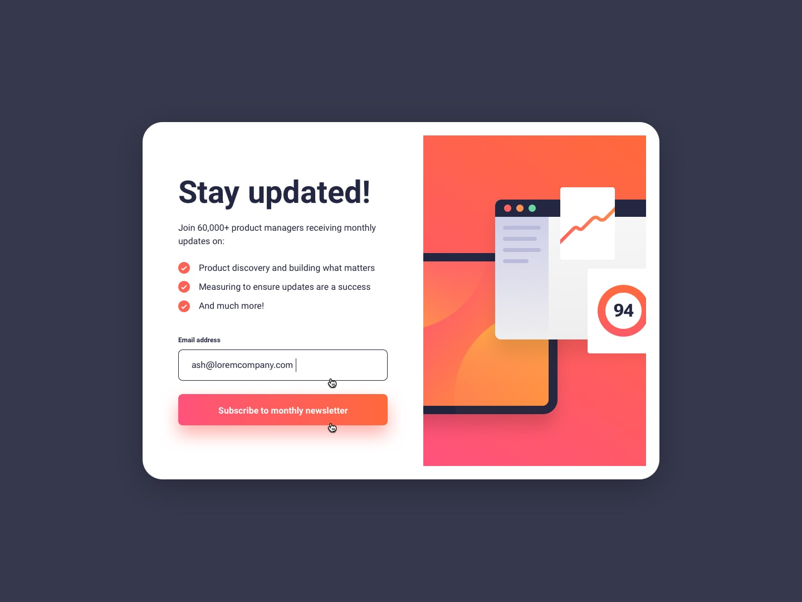
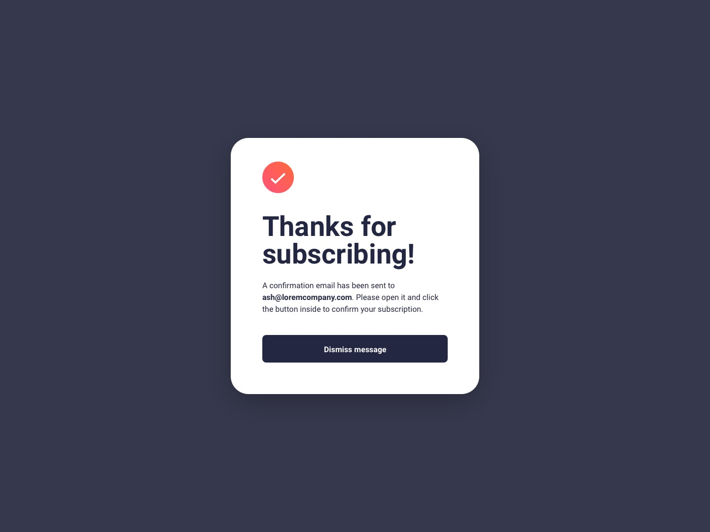

# Frontend Mentor - Newsletter sign-up form with success message solution

This is a solution to the [Newsletter sign-up form with success message challenge on Frontend Mentor](https://www.frontendmentor.io/challenges/newsletter-signup-form-with-success-message-3FC1AZbNrv). 

## Overview

### The challenge

Users should be able to:

- Add their email and submit the form
- See a success message with their email after successfully submitting the form
- See form validation messages if:
  - The field is left empty
  - The email address is not formatted correctly
- View the optimal layout for the interface depending on their device's screen size
- See hover and focus states for all interactive elements on the page

### Screenshot

### Links

- Solution URL: ['-']
- Live Site URL: ['-']

## My process

### Built with

- Semantic HTML5 markup
- CSS3
- Mobile-first workflow

### What I learned

- I created this project using HTML5, CSS3 with Flexbox, and JavaScript. 
- Through this project, I gained hands-on experience with the EmailJS API, which allowed me to       seamlessly send emails to users. 
- Additionally, I learned how to navigate users to a dedicated success message page after successfully submitting their email. 
- Leveraging JavaScript's localStorage feature, I efficiently stored temporary data, such as user emails, to personalize the success message page for a more user-friendly experience.

## Author

- Website - [Developing...]
- Frontend Mentor - [@yourusername](https://www.frontendmentor.io/profile/yourusername)

## Acknowledgments

This is where you can give a hat tip to anyone who helped you out on this project. Perhaps you worked in a team or got some inspiration from someone else's solution. This is the perfect place to give them some credit.
